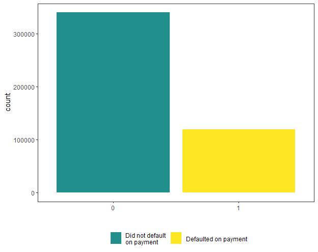

\spacing{1.25}
# Data

## Underlying Data

Data used for this project was obtained from the Kaggle website which is a crowd-sourced platform and community to train and challenge data scientists to solve complex data science, machine learning and predictive analytics problems.[^kag] One of Kaggles main features is it's competition platform.[^comp] Kaggle allows users to organise and host competitions, these range from commercially-purposed prediction problems to more experimental research competitions. They give entrants the opportunity to grow their data science skills and compete for prizes and gives hosts a outlet to tackle a tough business problem by turning it into a competition and allowing Kaggles user base of 10 million to provide potential solutions to the problem.

Access to the data through this route requires registering with Kaggle and joining the American Express - Default Prediction competition.[^kagamex] American Express is a globally integrated payments company. The largest payment card issuer in the world, they provide customers with access to products, insights, and experiences that enrich lives and build business success.[^AMEX] This competition provides an industrial scale data set to build a machine learning model to predict credit card default using time-series behavioural data and anonymised customer profile information over the period of March 2017 to March 2018. The target binary variable i.e. default is calculated by observing 18 months performance window after the latest credit card statement, and if the customer does not pay due amount in 120 days after their latest statement date it is considered a default event.

Tabular data
\newpage

## Data Structure

Four files are provided as part of the Kaggle competition

### train_labels.csv
A list of unique customer identifiers `customer_ID` with the target label `target` indicating a default event with `target = 1` indicating a default, `target = 0` indicating no default. There are 458913 observations in this data meaning 458913 unique AMEX customers. 74.1% of customers in the data did not default on payment while 25.9% did

```{r def, echo=F,fig.align='center', out.height="60%",out.width="60%", fig.cap="Breakdown of defaults in training data"}

```

### train_data.csv 

 

### test_data.csv 

### sample_submission.csv 

## Data Engineering


## Data Cleaning

[^kag]:
https://www.kaggle.com/getting-started/44916

[^kagamex]:
https://www.kaggle.com/competitions/amex-default-prediction/data

[^AMEX]:
https://about.americanexpress.com/our-company/our-business/our-business/default.aspx

[^comp]:
https://www.kaggle.com/docs/competitions

