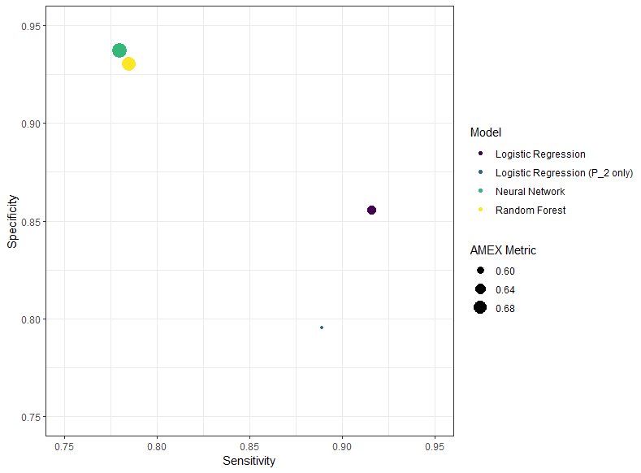

# Results

\spacing{1}
\scriptsize

```{r,  echo=FALSE}
# load result vectors
library()


results <- readRDS("results.rds")
kable(results, caption = "Test data results")
```


```{r}
pred_full <- readRDS("pred_full.rds")
# completely right - all rows in agreement 1 or 0
sum(rowSums(pred_full) == 5 | rowSums(pred_full) == 0 )/nrow(pred_full)

# completely wrong - four predictions opposite to observed
comp_wrong1 <-(pred_full[,1] == 0) & (rowSums(pred_full[,c(2,3,4,5)]) == 4) 
comp_wrong2 <-(pred_full[,1] == 1) & (rowSums(pred_full[,c(2,3,4,5)]) == 0)

(as.numeric(summary(comp_wrong1)[3])+as.numeric(summary(comp_wrong2)[3]))/nrow(pred_full)

# majority vote - 2 vs vote for default
maj <- ifelse(rowSums(pred_full[,c(2,3,4,5)]) < 2, 0, 1)

table(maj, pred_full[,1])
#sensitivity specificity and accuracy
tabfunc <- function(pred, obs){
  tab <-table(obs, pred)
  acc <- sum(diag(tab))/sum(tab)
  sens <- tab[2,2]/sum(tab[2,c(1,2)])
  spec <- tab[1,1]/sum(tab[1,c(1,2)])
  return(c(sens, spec, acc))
}
# sens, spec and acc
tabfunc(maj,pred_full[,1])


```

\spacing{1.25}
\normalsize


```{r, echo=F,fig.align='center', out.height = "80%",out.width = "80%", fig.cap="FourFold Plot of Test Data Results"}

knitr::include_graphics("fourfoldplot.png")
```

```{r echo=F,fig.align='center', out.width="90%",fig.cap="Bar Chart of Results by Model"}
knitr::include_graphics("bar.png")
```

```{r echo=F,fig.align='center', out.height="50%", fig.cap="Plot of Sensitivity vs Specificty by Model"}

```


\newpage


