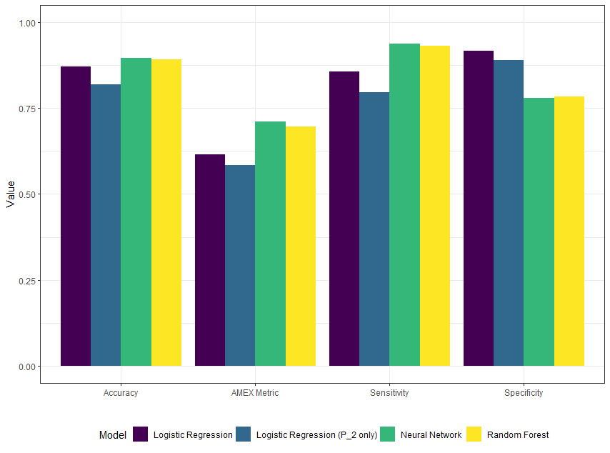

# Results

## EDA

## Final Models 
\spacing{0.9}
The training and validation process yielded the following four models which were used to predict the test observations.\vspace{-0.5cm}   

- Logistic regression model of all features using a classification threshold of 0.223. This will be referred to as the "full LR" model.  
- Logistic regression model using P_2 feature as the only predictor variable using a threshold of 0.208. This will be referred to as the "reduced LR" or "simple LR" model.  
- The optimal Random Forest model best on repeated cross-validation was found to use a random sample of 20 variables at each split and generating 100 trees.  
- Brief format of Final NN

\spacing{1.1}
## Model Comparrison

A full table of result metrics can be seen in Appendix A.

In terms of accuracy, NN and RF both slightly outperform LR and achieve an accuracy that is 0.07 greater than the accuracy produced by the reduced LR model. That pattern of results is repeated in the Sensitivity. Of all the customers who defaulted in the test set, the Neural Network and Random Forest correctly identified over 90% of them. The full LR model correctly identified 85% while the simple LR identified under 80%. The full LR model achieves the highest specificity on the test data out of the four models with over 0.91 recorded. The simple LR model records the second highest specificity with 0.89 while both the Neural and Random Forrest recorded specificities of 0.78.

As the Sensitivity has a positive effect in the calculation of the AMEX metric, it is only logical that NN and RF would fare better than the two LR models. With a value fo 0.71, the NN model is the only one to record a AMEX metric greater than 0.7. The RF model records an metric value of 0.69 while the full and simple LR models achieved values of 0.61 and 0.58 respectively.

```{r echo=F,fig.align='center', out.width="80%",fig.cap="Bar Chart of Results by Model", fig.pos="H"}

```


On initial inspection, the four ROC curves produced by the model appear quite, however the ROC curves for the simple LR model and the RF model don't extend as close to the top-left of the plot as much as the full LR and the NN models. This is confirmed when comparing the Areas Under the Curve (AUC). The full LR and NN models recorded an AUC of over 0.95 while the other two models only recorded AUC's of 0.92.

```{r, echo=F,fig.align='center', out.height = "80%",out.width = "80%", fig.cap="Receiver Operating Characteristic (ROC) curve for each Model.", fig.pos="H"}


```

```{r, echo=F,fig.align='center', out.height = "80%",out.width = "80%", fig.cap="FourFold Plot of Test Data Results", fig.pos="H"}

knitr::include_graphics("fourfoldplot.png")
```


