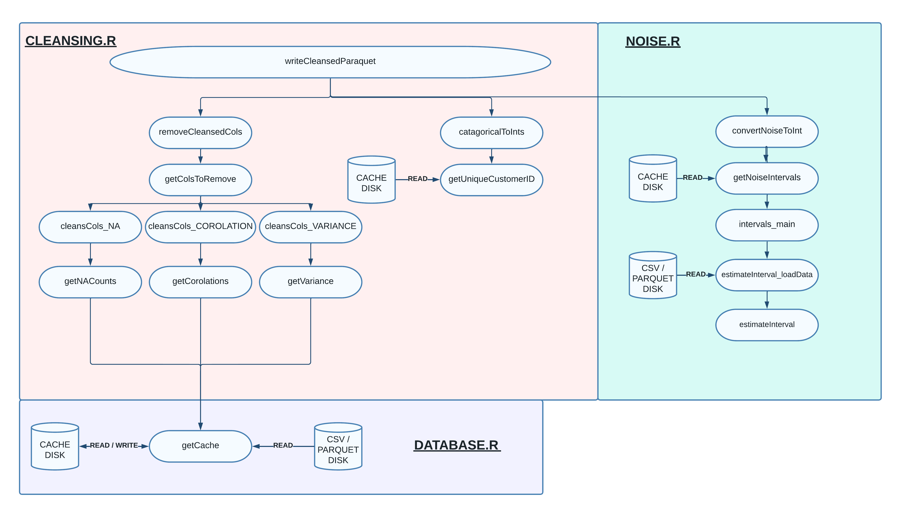

Comparison and Evaluation of Differentmachine Learning Methods at
Predicting Credit Card Default
================

-   <a href="#blue_book-overview" id="toc-blue_book-overview">:blue_book:
    Overview</a>
-   <a href="#open_file_folder-files"
    id="toc-open_file_folder-files">:open_file_folder: Files</a>
-   <a href="#heavy_exclamation_mark-requirements"
    id="toc-heavy_exclamation_mark-requirements">:heavy_exclamation_mark:
    Requirements</a>
    -   <a href="#r--r-studio" id="toc-r--r-studio">R / R-Studio</a>
    -   <a href="#tensorflow" id="toc-tensorflow">Tensorflow</a>
-   <a href="#wrench-installation" id="toc-wrench-installation">:wrench:
    Installation</a>
-   <a href="#triangular_ruler-structure"
    id="toc-triangular_ruler-structure">:triangular_ruler: Structure</a>
    -   <a href="#github" id="toc-github">Github</a>
    -   <a href="#google-drive" id="toc-google-drive">Google Drive</a>
-   <a href="#floppy_disk-scripts"
    id="toc-floppy_disk-scripts">:floppy_disk: Scripts</a>
    -   <a href="#mainr" id="toc-mainr">main.R</a>
    -   <a href="#feature-engineering" id="toc-feature-engineering">Feature
        Engineering</a>
    -   <a href="#machine-learning-models"
        id="toc-machine-learning-models">Machine Learning Models</a>
    -   <a href="#auxiliary-scripts" id="toc-auxiliary-scripts">Auxiliary
        Scripts</a>
-   <a href="#vertical_traffic_light-run-times"
    id="toc-vertical_traffic_light-run-times">:vertical_traffic_light: Run
    Times</a>
-   <a href="#two_men_holding_hands-contributors"
    id="toc-two_men_holding_hands-contributors">:two_men_holding_hands:
    Contributors</a>

# :blue_book: Overview

The aim of this project is to apply a range of machine learning
techniques to predict credit card default using the historical data of
credit card customers. The following report describes the process
undertaken to compare a number of models. Beginning with an industrial
size dataset, cleansing and formatting the data before using it to
train, tune and evaluate the chosen models (Neural Network, Random
Forest and Logistic Regression) based on the historical data of credit
card customers.

# :open_file_folder: Files

[Code from Repository](project-sharshmanucd) 

[Datasets from Google
Drive](https://drive.google.com/drive/u/0/folders/1C2TYJRsVH681dylc8ZX5A4gP-LsoaW7o)

# :heavy_exclamation_mark: Requirements

Each of the software packages below must be installed a prerequisite to
viewing the models

### R / R-Studio

R-Studio is required to be installed in order to review the codebase.  
Installation guide:
<https://rstudio-education.github.io/hopr/starting.html>

### Tensorflow

Tensorflow and keras are required to be installed to run the Neural
Network Model.  
Installation guide: <https://keras.rstudio.com/install/index.html>

# :wrench: Installation

Once all files have been downloaded, root/R/main.R must be configured in
order to specify path variables.

-   PATH_WD - Root of working directory from Github clone
-   PATH_DB - Root of database directory downloaded from Google Drive

**NB** :exclamation:

-   **paths must end in a “/” separators
    (e.g. /Users/root1/Documents/CreditCardDefault/)**
-   **Windows directories must have either “\\\\” or “/” separators**

Once all fields have been filled, run main.R to load all required files
into memory.  
From here all functions are available to call, see code comments per
script for more details.

# :triangular_ruler: Structure

### Github

    CreditCardDefault
    │   README.md
    │
    └─── cache
    │
    └─── paper
    │
    └─── plots
    │
    └─── R
    │   │   amex_metric.R
    │   │   cleansing.R
    │   │   database.R
    │   │   DNN.R
    │   │   EDAPlots.R
    │   │   logisticP2.R
    │   │   main.R
    │   │   NeuralNetwork.R
    │   │   Noise.R
    │   │   readme
    │   │   rf_logreg.R

### Google Drive

Data store for original CSV files and processed parquet files.  
Results available here including tuned models stored in RDS files.

**NB ** :exclamation: Google Drive may rename directories and split into
multiple downloads, please ensure to correctly assemble the database as
shown below

    CreditCardDefault_Database
    │
    └─── csv
    │   │   train_data.csv
    │   │   train_labels.csv
    └─── parquet
    │   │   data_lastPerCustomerID.parquet
    │   │   train_data.parquet
    └─── results
    │   │   NN_tuningRuns

# :floppy_disk: Scripts

### main.R

Primary file used to load all scripts.  
See installation instructions above.

### Feature Engineering

Feature engineering functions are stored within 3 files:

-   database.R
    -   Manages reading / writing to disk
-   cleansing.R
    -   Functions to determine NA / Coloration / Covarience thresholds
-   noise.R
    -   Functions to remove injected noise in features.

### Machine Learning Models

4 Models are evaluated as part of the project

-   Logistic Regression
-   Random Forest
    -   rf_logreg.R
-   Logistic Regression (Subset on the single P_2 feature)
    -   logisticP2.R
-   Neural Network
    -   NeuralNetwork.R
        -   Wrapper to run neural network
    -   DNN.R
        -   Neural Network Model
    -   NN_tuningResults.R
        -   Functions to analyse neural network tuning results, and
            train network on best parameters

### Auxiliary Scripts

-   amex_metric.R
    -   Function to compute competition metric (Normalized Gini
        Coefficient)
-   EDAPlots.R
    -   Functions to plot exploritory data analysis plots

# :vertical_traffic_light: Run Times

Because of the large amount of data involved (even after feature
engineering) the models take a significant length of time to run.  
Tuned models are available for inspection in the Google Drive under
results.

| Model                    | Script          | Tuning Length   |
|--------------------------|-----------------|-----------------|
| Logistic Regression (P2) | logisticP2.R    | :green_square:  |
| Logistic Regression      | rf_logreg.R     | :yellow_square: |
| Neural Network           | NeuralNetwork.R | :red_square:    |
| Random Forest            | rf_logreg.R     | :red_square:    |

# :two_men_holding_hands: Contributors

Sidney Harshman-Earley <sidney.harshman-earley@ucdconnect.ie>  
Denis O’Riordan <denis.oriordan1@ucdconnect.ie>
